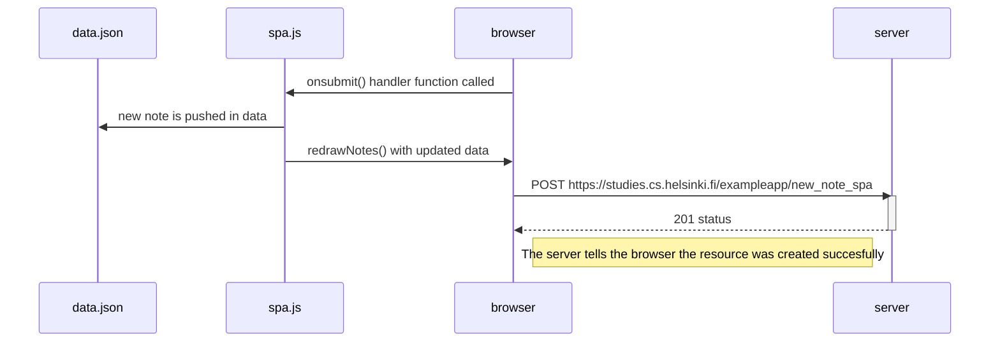

# Diagram for submiting a forum on a SAP webpage

```mermaid
sequenceDiagram
    participant data.json
    participant spa.js
    participant browser
    participant server
    
    browser->>spa.js : onsubmit() handler function called
    spa.js->>data.json : new note is pushed in data
    spa.js->>browser : redrawNotes() with updated data 
    browser->>server : POST https://studies.cs.helsinki.fi/exampleapp/new_note_spa
    activate server
    server-->>browser: 201 status
    deactivate server
    Note right of browser: The server tells the browser the resource was created succesfully
```
